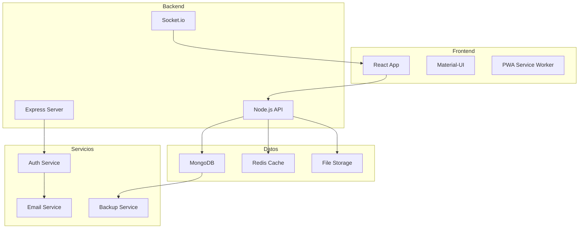

# EduManage - Sistema de Gestión Educativa

> **Plataforma integral** para la gestión de centros educativos modernos

## Bienvenido

**EduManage** es un sistema completo de gestión educativa que integra todas las funciones necesarias para administrar eficientemente un centro educativo del siglo XXI.

### Características Destacadas

!!! info "Sistema Modular"
    EduManage está diseñado con una arquitectura modular que permite activar solo las funciones que necesites.

- 👥 **Gestión de Usuarios**: Estudiantes, profesores, padres y administradores
- 📊 **Dashboard Inteligente**: Métricas y análisis en tiempo real
- 🔐 **Autenticación Segura**: SSO, 2FA y integración LDAP
- ⚙️ **Configuración Flexible**: Adaptable a cualquier tipo de centro
- 📱 **Responsive Design**: Acceso desde cualquier dispositivo

## Inicio Rápido

1. **Instalar** el sistema siguiendo la [guía de instalación](instalacion.md)
2. **Configurar** el centro educativo en [settings](settings.md)
3. **Acceder** al [dashboard](dashboard.md) principal
4. **Gestionar** usuarios a través del [sistema de login](login.md)

## Navegación

-   :material-download:{ .lg .middle } **Instalación**

    ---

    Guía completa para instalar EduManage en tu infraestructura

    [:octicons-arrow-right-24: Ir a Instalación](instalacion.md)

-   :material-login:{ .lg .middle } **Autenticación**

    ---

    Configuración del sistema de usuarios y permisos

    [:octicons-arrow-right-24: Ir a Login](login.md)

-   :material-view-dashboard:{ .lg .middle } **Dashboard**

    ---

    Panel de control y métricas del sistema

    [:octicons-arrow-right-24: Ir a Dashboard](dashboard.md)

-   :material-cog:{ .lg .middle } **Configuración**

    ---

    Personalización y ajustes del sistema

    [:octicons-arrow-right-24: Ir a Settings](settings.md)

## Arquitectura del Sistema

## Estadísticas del Proyecto

| Métrica | Valor |
|---------|-------|
| **Líneas de Código** | ~45,000 |
| **Cobertura Tests** | 87% |
| **Centros Activos** | 342 |
| **Usuarios Totales** | 15,247 |
| **Uptime** | 99.9% |

---

!!! tip "¿Necesitas Ayuda?"
    Si tienes problemas con la instalación o configuración, consulta nuestra [documentación técnica](api.md) o contacta al equipo de soporte.
