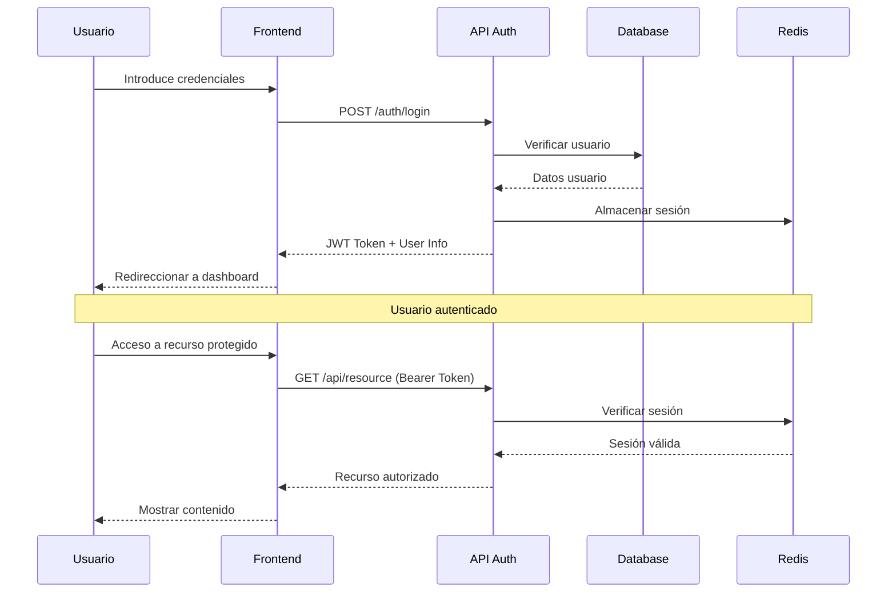

---

##  `modulos/login.md`

# Módulo de Autenticación (Login)

El módulo de **autenticación** permite verificar la identidad de los usuarios mediante credenciales seguras (email/usuario y contraseña).

---

##  Flujo de autenticación
